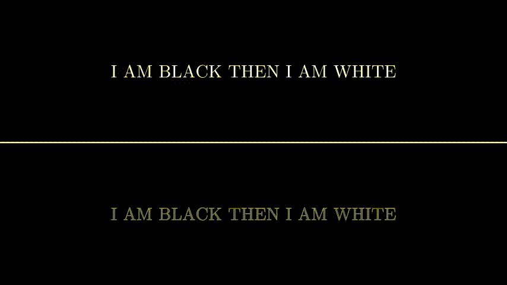

# 第一章 魔法导论

> I'M BLACK THEN I'AM WHITE &nbsp;&nbsp;&nbsp;&nbsp;&nbsp;&nbsp;&nbsp;&nbsp;&nbsp; &nbsp;&nbsp;<span class="song_name">Crusher-P 《ECHO》</span>

在Aegisub的魔咒中，可以大致上分为两种魔咒，一种叫定义魔咒，另一种叫变化魔咒。

简单的理解起来就是，变化魔咒所起到的作用是使一种东西变化。而定义魔咒所起到的作用是对一种东西的一个属性进行定义，如位置，颜色等。因此有的变化魔咒能和定义魔咒一起用，而有的却不可以。这些我们在后文会进行详细的讲述。

每个魔咒都有三部分：
  - 起始符 - 用于标志一个魔咒的开始，固定为`\`。
  - 主魔咒 - 用于定义动作，即该魔咒执行的动作。即`what`
  - 副魔咒 - 用于修饰主魔咒，即告诉主魔咒应如何执行。即`how`

每个魔咒都应该用一对界定符来与普通的字幕进行区分。不管是单独魔咒还是组合魔咒都一样

接下来以一个简单的颜色定义魔咒来说明

```text
{\c&H0000FF&}字幕
```

将这个魔咒分解开来解释

```text
   {      \      c   &H&0000FF&  }      字幕
   |      |      |       |       |       |
   |      |      |       |       |       |
   |      |      |       |       |       |
左定界符 起始符  主魔咒   副魔咒   右定界符 普通字幕
```

这个魔咒的作用是将当前的字幕颜色变为：<span style="background-color:red">&nbsp;&nbsp;&nbsp;</span>，在屏幕上这一行字幕将会显示为：<span style="color:red">字幕</span>

`c`为主魔咒，作用是将后面的字幕变为副魔咒所定义的颜色，`&H&0000FF&`是副魔咒，是一个以`BGR`的顺序记录的16进制颜色字符串。

更复杂的魔咒会在后面讲到。

## 第一节 定义 :id=define

接下来稍微讲一下定义魔咒。

定义是所有魔法研究中的基础，你需要对一样事物下定义，这样事物才会出现。当你不输入任何魔咒，只输入普通字幕的时候，你就定义了一个普通的字幕。接下来你输入魔咒之后，你就定义了一个带有魔咒的字幕，这个字幕将会按照魔咒中所定义的属性进行展示，那么，我们可以得到一个定义

<span class="definition">定义魔咒用于定义字幕的属性</span>

定义魔咒所定义的是字幕的属性，而一个字幕包括三部分：分别是 **本体**、**边框**、**阴影**。而三部分包含的属性各有不同与共同的一些属性，另外也有一些属性对整个字幕做出改变的。在此不对这些属性进行详细的说明。

而属性又分为以下的几类：
- 颜色属性
    - 颜色
    - 透明度
- 形态属性
    - 大小
    - 位置
    - 间隔
    - 旋转角度
    - 旋转中心
    - 剪切
    - 遮罩
    - 模糊
- 其它属性
    - 对齐方式
    - 旋转中心
    - 字符集
    - 字符

当你使用魔咒时，你便对这个字幕的某一个属性进行了定义了。

## 第二节 变化 :id=change

事物渐渐地发展过程, 叫做变 。事物从有到无 ,突然发生, 叫做化。简单来说，就是一件事物被另外的事物取代，就叫做变化。那么可以得出一个简单的结论，变化的根本在于时间的流动。若时间不流动，则取代与发展就无从说起。

那么我们就可以得出另一个结论，在本魔法中，对于变化来说有三个基本条件。
  - 时间 - 从什么时候开始，到什么时候结束
  - 起始状态 - 一开始是什么样子的
  - 结束状态 - 最后是什么样子的
  
!> 某些变化可能含有多个过程，应当对这些过程进行拆分研究。

起始状态和结束状态都是一个定义魔咒，定义了该字幕在这个时候应该如何呈现。打个比方，我定义一个字幕的起始状态是红色的，结束状态是绿色的，时间是从开始到结束，那么这个字幕的变化就是在这个持续时间内从红色变为绿色。当然，变化不仅包含了颜色的变化，形态上甚至在空间上都能进行改变。而除了某些特殊的魔咒，你也能控制这个变化的速率。有关具体的控制方法的讨论超出了本章的内容范围，同样的，我们也能得出一个定义。

<span class="definition">变化魔咒用于改变字幕的属性</span>

同时需要注意的是，我们在变化魔咒中定义的时间一般是相对于字幕而言的时间，也就是说对于大多数变化魔咒而言，应当从0开始计时，也就是说从字幕出现开始时计时。简单来说就是字幕时间是一个相对于视频时间的相对坐标系，比如说我需要让一个字幕淡入500毫秒，那么这个变化魔咒的开始时间就是0，结束时间是200。

```text
    0                   1                   2 (s)
    |-------------------|-------------------|----------  <---视频
    ↑         |-------------------------| <---字幕
视频开始时间    ↑         ↑              1300 (ms)
              0        500
         字幕开始时间  淡入结束
           淡入开始
```

## 第三节 复杂的副魔咒 :id=complex

你可能意识到，在某些情况下副魔咒会变得复杂起来，例如下面的这一个包含了一对括号的定位魔咒
```text
{\pos(1023,839)}
```
这个魔咒的作用是定义这个字幕在画面中的位置，而要在一个平面中描述一个物体的位置至少需要两个参数：x坐标与y坐标。这样的话就需要一个其他的定界符来与其他的魔咒进行区分，显而易见地，对副魔咒而言，定界符是一对括号。

也有一些更为复杂的副魔咒如移动魔咒，有至少4个参数，至多6个参数。有关移动魔咒的讨论超出了本章的内容范围，我们会在后面的章节对其进行进一步的讲述。

你可能注意到，在上面的定位魔咒的副魔咒中，除了定界符还有一个逗号，这个叫做分隔符，用于分隔不同的参数，在本例中，逗号用于分隔x坐标与y坐标。

## 第四节 将魔咒组合起来 :id=combine

当你需要定义多个属性的时候，将字幕分开来然后再定义就不是一个好主意了。这个时候你可以将多个魔咒写到一起来同时定义属性，你可以像这样：

!> 在点击查看效果之前先自己想想会是怎样的

<!-- tabs:start -->
#### **魔咒**
```text
I AM {\1c&HFFFFFF&}BLACK{\r} THEN I AM {\1c&H000000&} WHITE
```
#### **效果**
**此处背景色为方便演示**

<span style="background:lightblue;color:lightcoral">I AM <span style="color:black">BLACK</span> THEN I AM <span style="color:white">WHITE</span></span>

#### **动态演示**



<!-- tabs:end -->

或者像这样：

<!-- tabs:start -->
#### **魔咒**
```text
NO! SOMETHING ISN'T {\1c&H&0000FF&\fs100\b1} RIGHT! 
```
#### **效果**
NO! SOMETHING ISN'T **<span style="color:red;font-size:50px">RIGHT!</span>**
<!-- tabs:end -->

你会发现，魔咒里面如果有相同的魔咒，会是最后一个定义魔咒起效果，你可以像这样测试一下

<!-- tabs:start -->
#### **魔咒**
```text
MY ENEMY'S {\1c&HFF0000&\1c&H0000FF&}INVISIBLE
```
#### **效果**
MY ENEMY'S <span style="color:red">INVISIBLE</span>
<!-- tabs:end -->

还有需要注意的一点是，当有的定义魔咒发生冲突的时候，也会是最后一个定义魔咒起效果。就是说后面施加相同的魔咒的话，后面的魔咒会把前面的覆盖掉。

---
<h4>最后，思考一个问题，定义和变化之间的关系是什么？变化是指什么的变化？</h4>